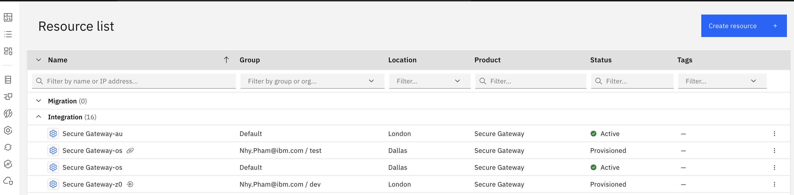
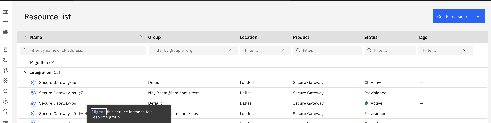
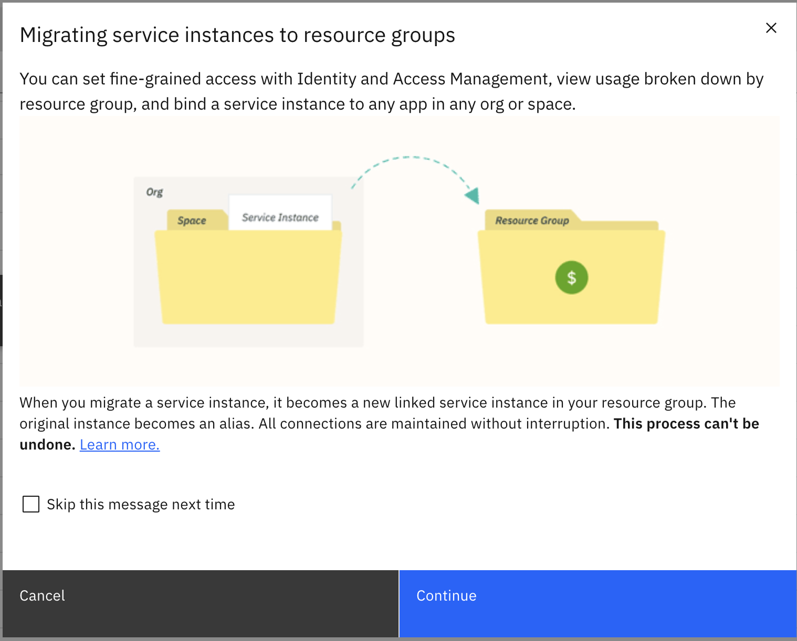
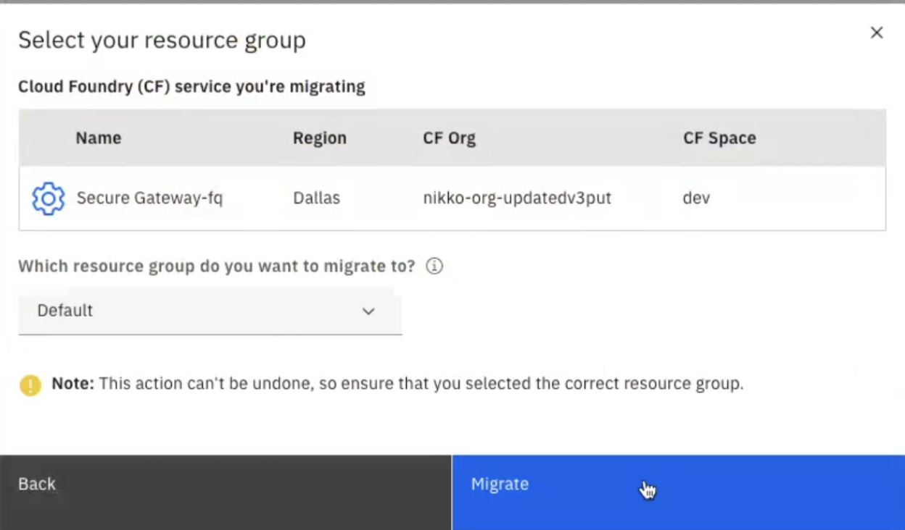
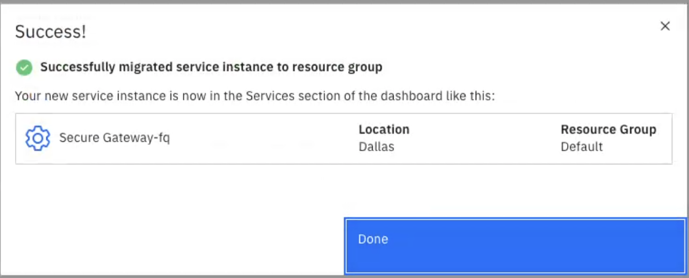
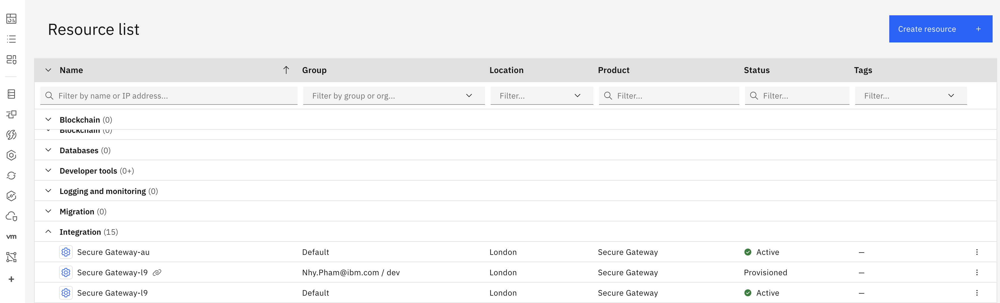
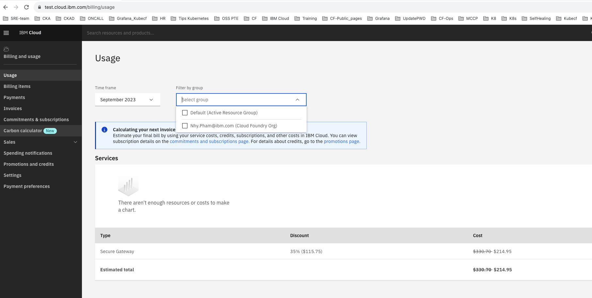

---

copyright: 
  years: 2023, 2023
lastupdated: "2023-10-09"

keywords: secure gateway, deprecation, migration, resource controller, resource groups

subcollection: SecureGateway

---

{{site.data.keyword.attribute-definition-list}}


# Updating a Secure Gateway instance to resource group
{: #rc-update}


These are the steps needed for the resource group update needed for Secure Gateway instances introduced in the [Resource group update](/docs/SecureGateway?topic=SecureGateway-rc_resouce_groups) page. Please be sure to fully review that page befor proceeding here.


Updating the Secure Gateway instance location from Cloud Foundry org/space to resource groups does not impact the Secure Gateway instance, function, or operation.

This update impacts only the Secure Gateway service resource group location, and the resulting authorization model will be updated to IBM Cloud Identity and access management (IAM). After the update, any creation or removal of Secure Gateway service instances will require IAM privileges. Using the Secure Gateway instances to pass data through a Gateway requires no new or different authorization, only for management of those instances.


## Prerequisites and notes
{: #rc-update-prereq}

- **Only one instance of Secure Gateway is allowed per resource group per IBM Cloud region**: You can have only a single service instance of Secure Gateway per resource group per region. So, you might need to create multiple resource groups to host multiple service instances in the same region. You can have up to 1000 resource groups in IBM Cloud if you have a billable account.

- **Resource groups can't be changed after migrating**: When you update your Secure Gateway instance to a resource group, the resource group that you choose cannot be changed after the update is complete. So, it is essential to plan how you want to organize resources in the account before you do this update.

## Best Practices
{: #rc-update-bestpractices}

- Define your own strategy for the number of and names used for your Resource Groups and how they will be used to organize your IBM Cloud resources.
- One common strategy is to use a single Resource Group for a set of resources that work together (e.g. by application, test vs prod).
- You can also add “Tags” to resource instances to organize their role and relationship with other resources within and across Resource Groups.
- When migrating Cloud Foundry-based Secure Gateway instances to a Resource Group you can target an existing Resource Group such as “Default”, or you can create a new Resource Group if you want to organize and manage Secure Gateway resources separately from existing Resource Groups.
- If you have multiple Secure Gateway instances in a single region you will need to use multiple Resource Groups as migration targets.  In that situation you may want to use a Resource Group naming pattern that reflects the Secure Gateway instance/region intersection and the role of the service (e.g SG-<region>-<role>).
- You may want to consider your future plans when organizing Secure Gateway instances in Resource Groups. You may see these Resource Groups as a temporary home that can be deleted when you are no longer using Secure Gateway, or as a long term home where new resource might someday go.

## Migrating your instances in the console.
{: #rc-update-console}


1. Login to https://www.cloud.ibm.com and select the **Navigation** menu icon, then select **Resource** list.

1. Click the **Integration** drop down menu to see the list of Secure Gateway instance(s) - or go to this [Secure Gateway resource list](https://cloud.ibm.com/resources?product=Secure%20Gateway)
    
1. Look for the small arrow icon next to a Secure Gateway instance, that is the **Migrate** button. Click the **Migrate** button next to the Secure Gateway instance you want to update, and then the "Migrate" link in that pop-up.
    
1. Click **Continue** in the confirmation pop-up.
    
1. Select your **Resource Group** from the drop down.
    
1. Confirm that the instance is updated for you.
    
1. After you successfully update an instance, you can now see two of those instance names in the Integration section filtered for [Secure Gateway resource list](https://cloud.ibm.com/resources?product=Secure%20Gateway). The **Migrate Button** has changed to a **Link** icon - which shows that it is now linked to the other named instance. The **Link** version is in a "Group" called Org/Space, where-as the new version is in a Group you selected, or perhaps "Default".
1. So the **Link** version is simply pointing to the **Resource Group** version, and is no longer needed by the IBM Cloud. You can delete the alias instance anytime.
      


## Updating your instances from the CLI
{: #rc-update-cli}

You can also do this using the IBM Cloud CLI. Be sure to authenticate normally as you would to the IBM Cloud using CLI commands.

1. Login to CLI and target the `cf` endpoints in the region you want to update Secure Gateway instances. Because IBM Cloud Foundry Public is deprecated, you need to enable the CF feature flag by running below command before target cf endpoint. 

    ```sh
    export IBM_CF_EXTENSION=true
    ```
    {: pre}

    ```sh
    ibmcloud cf install
    ```
    {: pre}

    ```sh
    ibmcloud target [-r REGION_NAME] [-g (RESOURCE_GROUP_NAME | RESOURCE_GROUP_ID [--cf-api ENDPOINT] [-o ORG] [-s SPACE]
    ```
    {: pre}

    Example commands and output.

    ```sh
    export IBM_CF_EXTENSION=true
    ibmcloud cf install

    Warning: IBM Cloud Foundry is deprecated. For details, see: https://cloud.ibm.com/docs/cloud-foundry-public?topic=cloud-foundry-public-deprecation
    Installed Cloud Foundry CLI version is '6.53.0'. Do you want to install and use latest version? [y/N] > y
    IBM Cloud Foundry Public is deprecated. For more information, see http://ibm.biz/ibmcf-announce
    Attempting to download Cloud Foundry CLI...
    8.93 MiB / 8.93 MiB [==============================================] 100.00% 1s
    <no value> bytes downloaded
    Saved in /Users/user/.bluemix/tmp/cf_2363512798/cf-cli_6.53.0_osx.tgz
    Installing Cloud Foundry CLI...
    OK
    Cloud Foundry CLI is successfully installed


    ibmcloud target -r eu-gb -g Default --cf-api https://api.eu-gb.cf.cloud.ibm.com -o <org> -s <space>

    Switched to region eu-gb
    Targeted Cloud Foundry (https://api.eu-gb.cf.cloud.ibm.com)
    Targeted org <org>
    Targeted space <space>
                      
    API endpoint:      https://cloud.ibm.com
    Region:            eu-gb
    User:              user@ibm.com
    Account:           User's Account (xxxxxxx)
    Resource group:    Default
    CF API endpoint:   https://api.eu-gb.cf.cloud.ibm.com (API version: 2.205.0)
    Org:               <org>
    Space:             <space>
    ```
    {: screen}


1. List the service instances in your CF org and space. Make a note of the service ID of the Secure Gateway instance you want to migrate.

    ```sh
    ibmcloud cf services
    ```
    {: pre}

1. Run the following command to migrate the instance.
    ```sh
    ibmcloud resource cf-service-instance-migrate (SERVICE_INSTANCE_NAME | SERVICE_INSTANCE_ID) [--resource-group-name RESOURCE_GROUP_NAME | --resource-group-id RESOURCE_GROUP_ID] [-f, --force] [-q, --quiet]
    ```
    {: pre}

    Example commands and output of a successful migration.
    ```sh
    ibmcloud resource cf-service-instance-migrate "Secure Gateway-z0" --resource-group-name Default

    Really migrate Cloudfoundry service instance Secure Gateway-z0 into resource group Default?> y

    Migrating Cloudfoundry service instance Secure Gateway-z0 into resource group Default as user@ibm.com...

    OK
    
    Service instance Secure Gateway-z0 was migrated into resource group Default successfully
    ```
    {: screen}


1. Confirm the instance was migrated by running the following command and reviewing the resource group ID.
   
    ```sh
    ibmcloud resource service-instances
    ```
    {: pre}

    Example output

    ```sh
    Retrieving instances with type service_instance in all resource groups in all locations under account User’s Account as user@ibm.com...
    OK
    Name                           Location   State    Type               Resource Group ID
    Secure Gateway-z0              eu-gb      active   service_instance   1b32c7b28b1c4ff786cc5a74376bc757
    ```
    {: screen}


## Important steps after updating to a Resource Group
{: #rc-update-after}

Manage users’ access to resources
:   After you update your Service Gateway instances to a resource group, you need to ensure that the users in your account have the required level of access to the resources in the account resource groups. The users need to be assigned the **Operator** or **Editor** role in IAM to manage the instance. This also provides access for users to create new service instances in the account resource groups. For more information about assigning access to resources in your resource groups, see [Managing access to resources](/docs/account?topic=account-assign-access-resources&interface=ui#assign-access-resources). As mentioned before, someone who uses the Secure Gateway instances to pass data through a Gateway requires no new or different authorization, only management of those instances requires those permissions.

Review the Billing dashboard
:   After updating, the billing for the Secure Gateway instance is still listed under a Cloud Foundry Org until the end of the month. The next month the billing can be checked under Resource group. Billing doesn't change or interrupt, just where you see it in the billing system.

 


